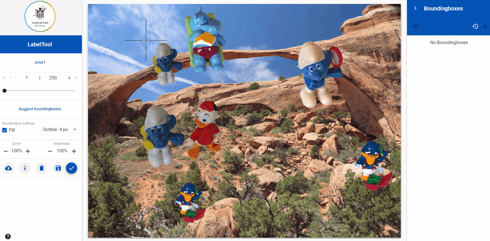
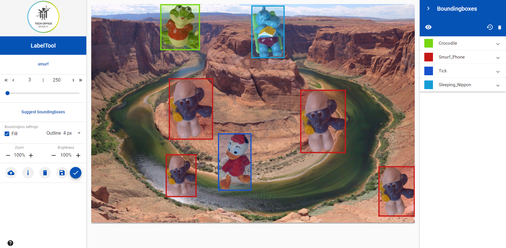
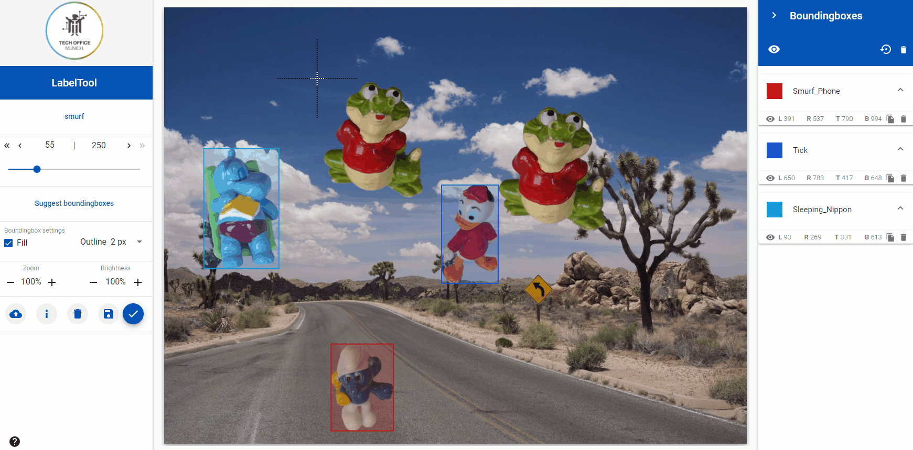
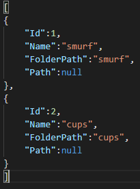
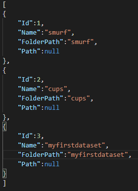
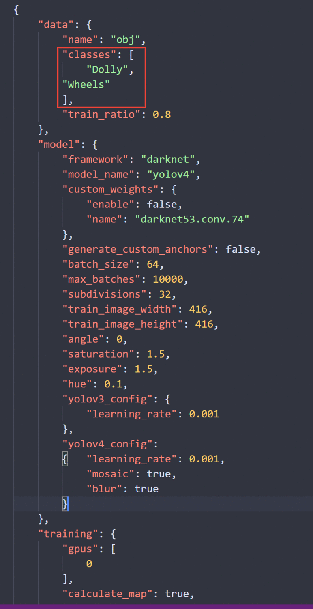
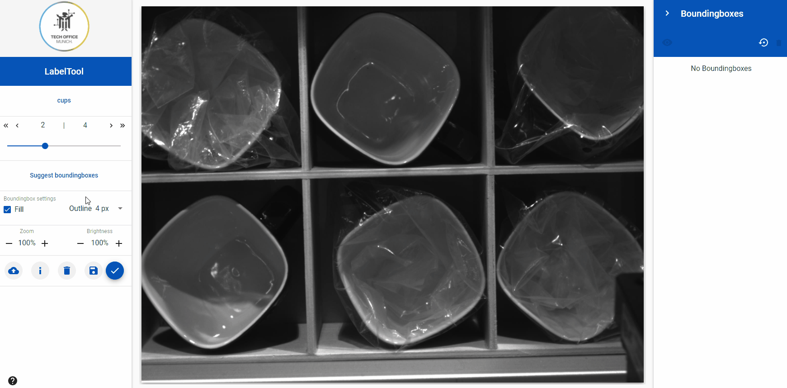

## LabelTool lite (update!!!)

--- 

This repository provides you with a image data annotation tool with little to no configuration needed! The lite version of the tool focuses on bounding box based training data annotation. You can start labeling your images for state-of-the-art deep learning training purposes right away with our dockerized _LabelTool lite_. You can also directly use the labels provided by the _LabelTool lite_ to train with our Yolov4 and Tensorflow Training GUI repositories:

[BMW-TensorFlow-Training-GUI](https://github.com/BMW-InnovationLab/BMW-TensorFlow-Training-GUI)

[BMW-YOLOv4-Training-Automation](https://github.com/BMW-InnovationLab/BMW-YOLOv4-Training-Automation)

Additionally, it is possible to connect a pre-trained or a custom-trained model to the _LabelTool lite_. This functionality allows one to accelerate the labeling process whereby the connected model can be actively used to suggest appropriate labels for each image. 



## Prerequisites

- Windows or Ubuntu

- Docker and Docker-compose

**PS: You may need to increase the shared memory docker is using**

## Running the _LabelTool lite_:

We provide a sample dataset in case you don't have your own custom dataset.

- To run the LabelTool lite and start labeling, simply go to your projects repository and run the command below:

```bash
docker-compose up
```

- Open any browser,  go to localhost:8081 and start labeling!

    

## Navigation options in LabelTool lite

- The _LabelTool lite_ offers different options that facilitates you to comfortably navigate through the data set whilst labeling:

  - Navigate to the next image in the data set - ">"
  - Navigate to the previous image in the data set - "<"
  - Navigate to the next image that has no bounding boxes - ">>"
  - Navigate to the previous image that has no bounding boxes - "<<"
  - Navigate to a particular image by inputting the image number directly
  - Navigate to any image by clicking or dragging the cursor on the scroll line

  


- In addition to the above mentioned features, the _LabelTool lite_ offers: 

  - Zoom-in and zoom-out functionality for the images
  - Increase and decrease of brightness for the images
  - New images (one at a time) can be uploaded to the data set from your local computer via the Upload button
  - Image attributes (name and resolution) can be displayed for each image 
  - Images (one at a time) and the corresponding bounding boxes can be deleted 

  

## Bounding box features

- The LabelTool lite offers a variety of functionalities for bounding box creation

  - The bounding boxes can be resized after creation 
  - The bounding boxes can be moved via drag and drop
  - The bounding boxes can be copied 
  - The bounding boxes can be set to Fill or Unfill 
  - The line thickness of the bounding boxes can be changed
  
  
  

## Preparing your custom dataset:

In your project's repository, this is how the training-data folder structure should look like after preparing your dataset (follow steps below):

```shell
│──/data/training-data
  │──myfirstdataset
  │  │──images
  │  │──labels
  │  │  │──json
  │  │
  │  │──objectclasses.json
  │
  │──topics.json
```

- The training-data folder is where all your datasets should be.

- For a new dataset, create a folder inside training-data (for example a folder called "myfirstdataset")

- Let's say that the topics.json file that is inside training-data currently looks like this:

  

  please add the following to your topics.json file just above the "]":

```json
  ,
  {
      "Id": 3,
      "Name": "myfirstdataset",
      "FolderPath": "myfirstdataset",
      "Path": null
  }
```

**Make sure you replace "myfirstdataset" with your dataset's name.**

After finishing , your topics.json file should look like this :

  

- Inside your "myfirstdataset" folder :

  - Create a folder called "images", this is where you put all the images that you need to label.

  - Create a folder called "labels", in "labels" create a folder called "json", this is where the labels are generated after labeling your images

  - Create a json file called "objectclasses", this is where you define your classes. An example of two different classes is shown below:

    In this example the classes are "Dog" and "Cat". Add the following to your "objectclasses.json" file. **Make sure to edit the classes names to match your own dataset. You can add or remove classes as needed.**

    ```json
    [
      {
        "Id": 0,
        "Name": "Dog"
      },
      {
        "Id": 1,
        "Name": "Cat"
      }
    ]
    ```

### Running the LabelTool lite:

- Open the docker-compose.yml file in your project's repository.
- The LabelTool lite runs on localhost:8081, if you want to change the port , replace 8081 in "**ports**" under "**labeltool-lite-frontend**" with the port number that you want

- Under "**volumes**" replace what's written before the ":" with your training-data folder absolute path. For Windows users, replace the "\\" in the path with "\\\\". (check the example below)

  

- Open a Terminal , go to your project's repository , and run the command below :

  ```bash
  docker-compose up
  ```

- go to localhost: **chosen_port** , choose your topic and start labeling

## Training with our Tensorflow Gui

To use the generated labels with our tensorflow gui follow the steps below :

- Make sure you downloaded our [BMW-TensorFlow-Training-GUI](https://github.com/BMW-InnovationLab/BMW-TensorFlow-Training-GUI) project.

- Go to training-data/

- Copy your dataset folder

- Go to our [BMW-TensorFlow-Training-GUI](https://github.com/BMW-InnovationLab/BMW-TensorFlow-Training-GUI) project's repository

- Go to "datasets" and paste the copied folder

**Follow the instructions on our Tensorflow Gui Github repository to launch and train it**

## Training with our Yolov4 and Yolov3-Training-Automation

To use the labels with our Yolov4-v3-Training-Automation, go to the labeltool's repository and run the command below :

```bash
python3 converttoyolo.py --dir myfirstdataset
```

**Make sure to replace "myfirstdataset" in the command with your dataset's folder name**

A new folder "yolo" is created inside your dataset's "labels" folder.

- Go to data/training-data/

- Copy your dataset folder

- Go to your Yolo project's repository

- Paste the copied folder

- Please note that a "train_config.json" file should be created inside your dataset's folder (Check our Yolov4-v3 Training Automation documentation). You can just copy the file from our sample_dataset and edit the classes field ( Check image below)

 

**Follow the instructions on our Yolov4-v3 Training Automation Github repository to launch it and train**

## Accelerate image annotation with a pre-trained model

Connect a trained model to the Labeltool GUI and accelerate the labeling process. 

  

To connect the model container to the Labeltool, modify the docker-compose.yml file to include it and re-build all the applications together. An example of how one should modify the docker-compose.yml file is shown below:

 


## Known Issues

-Only one model can be connected to the "Suggest bounding boxes" menu. If the Object classes in the connected model does not match the ones in the data set, no results or error messages will be displayed. When the "Suggest bounding boxes" does not deliver any response, please check the log files of the container and as well as the consistency of the Object classes between model and Topic. 

-All JSON files should be encoded in "UTF-8", otherwise an error may occur.


## Acknowledgements

[inmind.ai](https://www.inmind.ai/)

[Robotron](https://github.com/Robotron-GmbH)

Roy Anwar

[Eduard Saller](https://www.saller.io)
